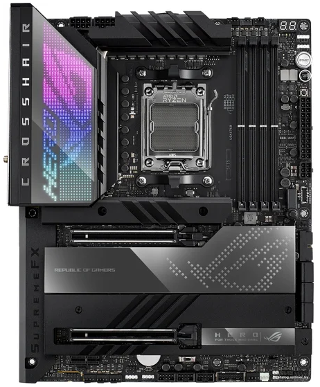

# Roman Pismerov

**Junior ASP.NET Developer**



## Navigation

- [About me](#about-me)
- [My skills](#my-skills)
- [My code](#my-code)
- [My courses](#my-courses)
- [Language Proficiency](#language-proficiency)
- [Contacts](#contacts)

## About me

I am a motivated 2nd-year Software Engineering student at the **Belarusian-Russian University**, focusing on C#. I possess advanced English proficiency and valuable experience living abroad, which has significantly enhanced my communication skills and adaptability.

> Although I am a junior without commercial experience, I am a fast learner, dedicated to writing high-quality code and ready to work in an international environment.

---

## My skills

- **Programming Languages:** `C#`
- **Frameworks:** `ASP.NET Core`
- **Version Control:** `Git`
- **Databases:** `SQL server`, `SQLite`

---

## My code

Пример реализации асинхронного сохранения данных в формате JSON:

```csharp
static async Task SaveBooksAsync(Book[] books)
{
    var options = new JsonSerializerOptions
    {
        WriteIndented = true,
        IncludeFields = true,
        Encoder = JavaScriptEncoder.UnsafeRelaxedJsonEscaping
    };

    using (FileStream fs = new FileStream(FileName, FileMode.Create))
    {
        await JsonSerializer.SerializeAsync(fs, books, options);
    }
    Console.WriteLine("Сохранение прошло успешно!");
}
```

---

## My courses

1. **Course** `C#`
2. **Course** `Git`
3. **Course** `SQL`

---

## Language Proficiency

- **English Level** `B!+`

---

## Contacts

- **Phone:** +375 (33) 349-11-83
- **Email:** [rpis20849@gmail.com](mailto:rpis20849@gmail.com)
